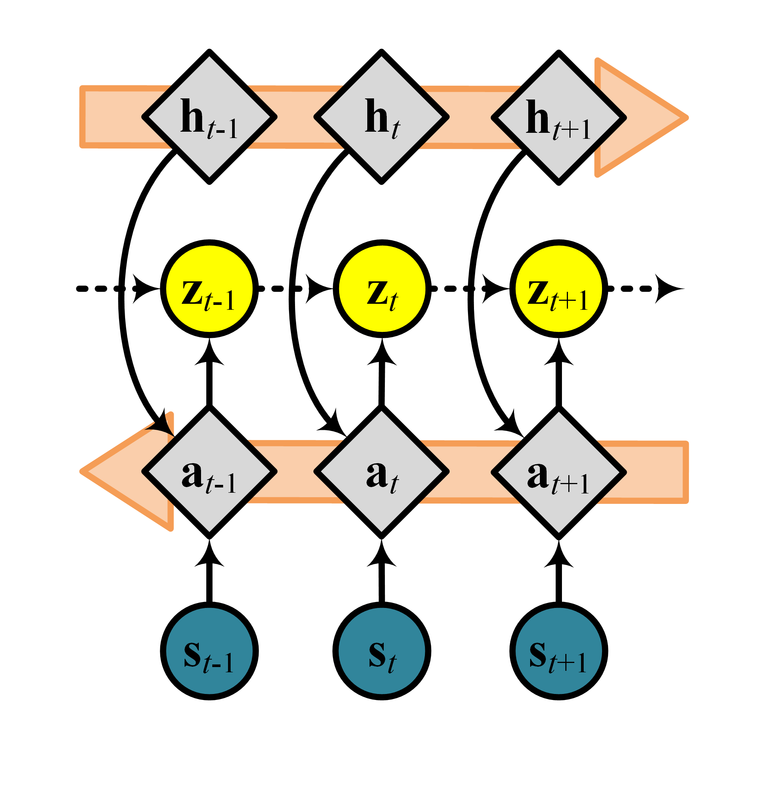
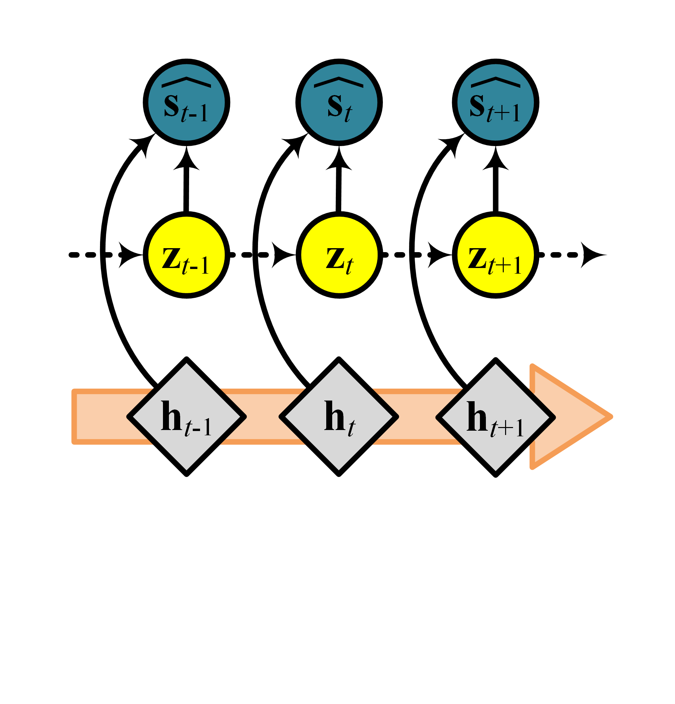

# Bi-VQRAE

The source code for paper “Anomaly Detection in Time Series with Robust
Variational Quasi-Recurrent Autoencoders”

## Abstract

We propose variational quasi-recurrent autoencoders (VQRAEs) to enable
robust and efficient anomaly detection in time series in unsupervised
settings. The proposed VQRAEs employs a judiciously designed objective
function based on robust divergences including alpha, beta, and
gamma-divergence, making it possible to separate anomalies from normal
data without the reliance on anomaly labels, thus achieving robustness
and fully unsupervised training. To better capture temporal dependencies
in time series data, VQRAEs are built upon quasi-recurrent neural
networks, which employ convolution and gating mechanisms to avoid the
inefficient recursive computations used by classic recurrent neural
networks. Further, VQRAEs can be extended to bi-directional BiVQRAEs
that utilize bi-directional information to further improve the accuracy.
The above design choices make VQRAEs not only robust and thus accurate,
but also efficient at detecting anomalies in streaming settings.
Experiments on five real-world time series offer insight into the design
properties of VQRAEs and demonstrate that VQRAEs are capable of
outperforming state-of-the-art methods.

## VQRAE

### qnet




### qnet



## Citation

If you use the code, please cite the following paper:

```latex
@inproceedings{DBLP:conf/icde/KieuYGCZSJ22,
	author     = {Tung Kieu and Bin Yang and Chenjuan Guo and Razvan-Gabriel Cirstea and Yan Zhao and Yale Song and Christian S. Jensen},
	title      = {Anomaly Detection in Time Series with Robust Variational Quasi-Recurrent Autoencoders},
	booktitle  = {{ICDE}},
	pages      = {1--13},
	year       = {2022}
}
```
